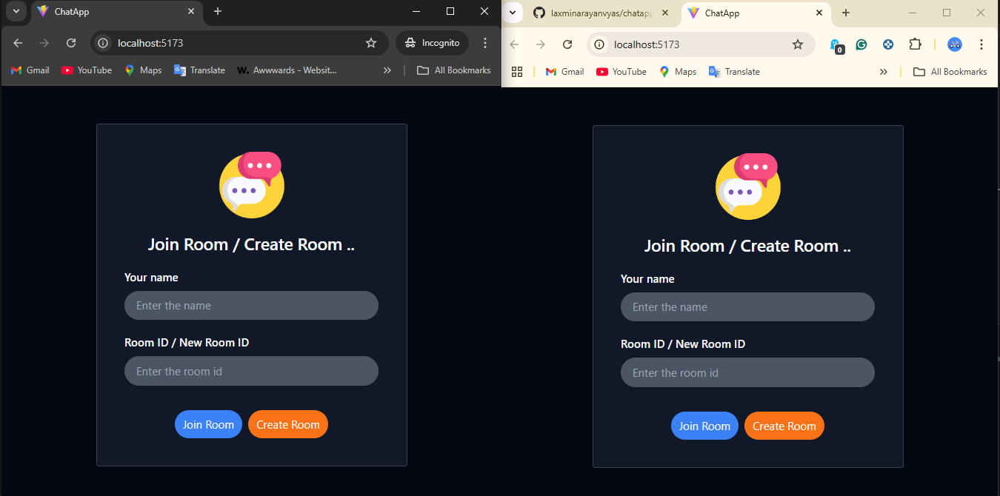
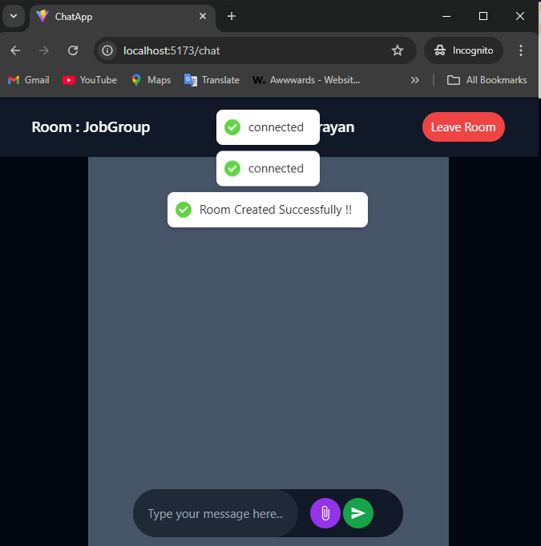

# Live Chat Application

A real-time chat application built with Java (Spring Boot) for backend and React for frontend. This app uses WebSockets, STOMP protocol, and MongoDB to provide seamless messaging between users in a chat room. Users can join existing rooms or create new ones, and chat in real-time.

## Features

- **Real-time Messaging**: Chat messages update in real-time with the help of WebSocket and STOMP.
- **User and Room Management**: Users can enter their name and select an existing room or create a new room if it doesn't exist.
- **Chat History**: The app displays the user's name, a random image, timestamp, and message.
- **MongoDB**: MongoDB is used to store user data, messages, and room information.
- **Responsive Design**: Built with React to provide a responsive and user-friendly interface.

## Tech Stack

- **Backend**:
  - Java
  - Spring Boot
  - WebSocket
  - STOMP Protocol
  - MongoDB
  - REST APIs

- **Frontend**:
  - React
  - WebSocket (STOMP integration)
 
## Screenshots
### 1. Home Page

### 2. Create Room

